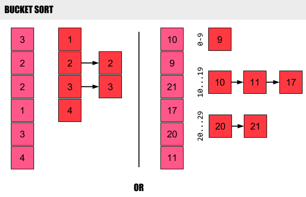

## Chapter 8

**Merge sort** and **heapsort** share an interesting property: _the sorted order they determine_
_is based only on comparisons between the input elements. We call such sorting_
_algorithms comparison sorts_. In a comparison sort, we use only comparisons between
elements to gain order information about an input sequence [a1, a2......aN].

### The decision-tree model

A **decision tree** is a full binary tree that represents the comparisons between elements
that are performed by a particular sorting algorithm operating on an input of a given
size. Control, data movement, and all other aspects of the algorithm are ignored.  The
execution of the sorting algorithm corresponds to tracing a simple path from the root of
the decision tree down to a leaf.

### Counting sort

Counting sort assumes that each of the n input elements is an integer in the range ```0``` to ```k```,
for some integer ```k```. When ```k = O(n)```, the sort runs in ```0(n)``` time.

Counting-sort is very efficient for sorting an array of integers when the length, ```n```,
of the array is not much smaller than the maximum value, ```k - 1```, that appears in the array.
That means that it is not efficient if we have very large numbers.

- Time Complexity: 0(n)
- Space Complexity: 0(n)
- Stable: Yes

### Bucket sort

It is very effective when either the data is evenly distributed over a range, or
we have a hash function that disperses it evenly.

If hashing function is ```hash(i) = i // 10```



Bucket sort can be seen as ```k-way``` merge sort.
